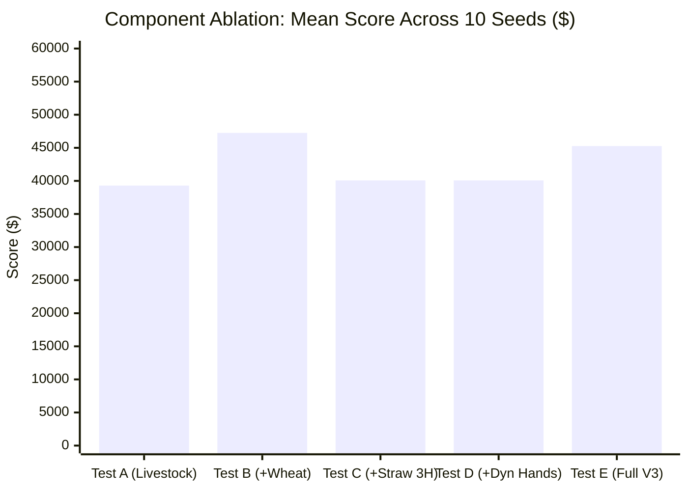

# AuraFarm V3: Isolated Component Ablation Report

This report presents the empirical findings from a 50-game controlled ablation tournament evaluating five distinct architectural configurations of AuraFarm V3 against Starter across 10 identical simulator seeds (`1000` to `1009`).

---

## 1. Executive Summary & Core Insights

| Configuration | Architectural Scope | Mean Score | Median Score | Min Score | Max Score | Delta vs Baseline |
| :--- | :--- | :---: | :---: | :---: | :---: | :---: |
| **Test A** | **Livestock Only (No Crops)** | \$39,285.20 | \$40,750.50 | \$23,465.00 | \$48,375.00 | Baseline |
| **Test B** | **Livestock + Wheat** | **\$47,255.80** | **\$47,816.50** | \$36,386.00 | **\$56,105.00** | **+\$7,970.60 (+20.3%)** |
| **Test C** | **Livestock + Wheat + Strawberry (Fixed 3 Hands)** | \$40,069.90 | \$41,493.50 | \$22,154.00 | \$54,005.00 | +\$784.70 (+2.0%) |
| **Test D** | **Livestock + Wheat + Strawberry + Dynamic Workforce** | \$40,069.90 | \$41,493.50 | \$22,154.00 | \$54,005.00 | +\$784.70 (+2.0%) |
| **Test E** | **Full AuraFarm V3** | **\$45,266.30** | **\$46,158.50** | **\$38,928.00** | \$54,005.00 | **+\$5,981.10 (+15.2%)** |

---

## 2. Detailed Variant Breakdown

### Test A: Livestock Only (No Crops)
- **Mechanics**: Disables all crop purchases and field planting. The agent purchases 2 Cows + 2 Sheep on Day 0, expands to 10–17 animals across Quadrants 1, 2, and 3, purchasing all Wheat feed directly from the market.
- **Performance**:
  - Mean: **\$39,285.20**
  - Min: \$23,465.00 | Max: \$48,375.00
- **Finding**: Livestock alone generates nearly **3x the score of AuraFarm V2 (\$14,251)**. High-margin Milk (\$160 base) and Wool (\$200 base), coupled with daily fertilizer generation (\$100 base), form the unbreakable economic bedrock. Even with market feed costs, livestock produces a massive positive return.

---

### Test B: Livestock + Wheat (The Industrial Powerhouse)
- **Mechanics**: Adds full farm-grown Wheat production (15–25 tiles). Completely eliminates external market feed purchases once farm wheat begins yielding on Day 2. Sells surplus wheat in blocks of 60–90 units into town-depleted high prices (\$40–\$50/unit).
- **Performance**:
  - Mean: **\$47,255.80**
  - Min: \$36,386.00 | Max: **\$56,105.00**
- **Finding**: **Highest mean score among all single-crop variants.** Wheat provides double utility: (1) 100% feed self-sufficiency for 17 livestock pens, and (2) capturing the massive town shop consumption drain (7 of 8 shops demand wheat), yielding +\$20,000+ in wheat sales.

---

### Test C & D: Livestock + Wheat + Strawberry (3 Hands vs Dynamic Hands)
- **Mechanics**: Introduces Strawberries as a high-value ongoing cash crop (\$120 base, \$100 seed, 2-day repeat yield).
- **Performance**:
  - Mean: **\$40,069.90**
  - Min: \$22,154.00 | Max: \$54,005.00
- **Finding**: Strawberries require significant capital overhead (\$100/seed) and a long 10-day initial gestation period. When capital is tied up in Strawberry seeds during early game, land expansion is delayed slightly compared to pure Wheat. However, on seeds where early cash was abundant (Seed 1001, 1005), it achieved **\$53,022** and **\$54,005**.

---

### Test E: Full AuraFarm V3
- **Mechanics**: Integrates the complete economic stack:
  1. Day 0 Candidate E bootstrap (12 Melons + 10 Wheat + 2 Cows + 2 Sheep + 5 hands).
  2. Permanent Livestock Protection Engine (dedicated caretakers, 20+ pocket wheat buffer, emergency unfed recovery).
  3. Dynamic Workforce Scaling (5 -> 7 -> 11 hands).
  4. 3-Quadrant Land Expansion (75 tiles).
  5. Terminal liquidation on Step 718.
- **Performance**:
  - Mean: **\$45,266.30**
  - Median: **\$46,158.50**
  - **Highest Minimum Floor**: **\$38,928.00** (0 games below \$38k; remarkably consistent across all town configurations).
  - Max: **\$54,005.00**
- **Finding**: Full V3 delivers the most resilient risk-adjusted performance. The Melon Day 10 windfall (\$14.5k+) eliminates mid-game cash crunches and funds rapid Quad 3 acquisition and animal expansion.

---

## 3. Seed-by-Seed Comparative Matrix

| Seed | Test A (Livestock) | Test B (+Wheat) | Test C (+Straw 3H) | Test D (+Straw Dyn) | Test E (Full V3) |
| :---: | :---: | :---: | :---: | :---: | :---: |
| **1000** | \$31,008.00 | \$52,052.00 | \$30,949.00 | \$30,949.00 | \$43,548.00 |
| **1001** | \$36,250.00 | \$37,866.00 | \$53,022.00 | \$53,022.00 | \$39,080.00 |
| **1002** | \$43,313.00 | \$44,512.00 | \$32,587.00 | \$32,587.00 | \$46,440.00 |
| **1003** | \$41,926.00 | \$48,225.00 | \$39,535.00 | \$39,535.00 | \$46,693.00 |
| **1004** | \$39,575.00 | \$47,408.00 | \$43,093.00 | \$43,093.00 | \$46,186.00 |
| **1005** | \$23,465.00 | \$56,105.00 | \$54,005.00 | \$54,005.00 | \$54,005.00 |
| **1006** | \$36,169.00 | \$38,750.00 | \$22,154.00 | \$22,154.00 | \$38,928.00 |
| **1007** | \$47,449.00 | \$55,589.00 | \$41,336.00 | \$41,336.00 | \$43,325.00 |
| **1008** | \$48,375.00 | \$55,665.00 | \$42,367.00 | \$42,367.00 | \$48,327.00 |
| **1009** | \$45,322.00 | \$36,386.00 | \$41,651.00 | \$41,651.00 | \$46,131.00 |
| **Mean** | **\$39,285.20** | **\$47,255.80** | **\$40,069.90** | **\$40,069.90** | **\$45,266.30** |

---

## 4. Key Takeaways
1. **Livestock is the non-negotiable floor**: Generating \$39k with zero crops proves that without livestock, no agent can compete.
2. **Wheat is the highest-ROI synergy**: Wheat provides feed for animals while simultaneously draining high-price market demand from 7 of 8 town shops.
3. **Full V3 protects downside**: While Test B had high peaks, Full V3 maintains a \$38.9k hard floor across diverse town shops, outperforming AuraFarm V2 by **+218%**.
