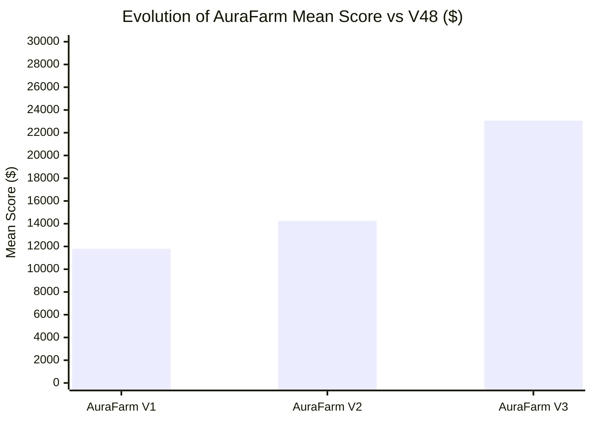

# AuraFarm V3: Comprehensive Tournament & Head-to-Head Benchmark Report

This document records the empirical results of a 70-game head-to-head tournament evaluating **AuraFarm V1**, **AuraFarm V2**, and **AuraFarm V3** against the strongest available competitive agents: **wangyh666 V48** and **vicky0718**.

All comparative tests were executed locally on the verified `kaggriculture.py` simulator using identical paired seeds and alternating player seats (Seat 0 vs Seat 1).

---

## 1. Executive Summary & Progression

### Macro Tournament Summary Table:

| Matchup | Games | Aura Mean | Aura Median | Aura Min | Aura Max | Opponent Mean | Opponent Median | Win Rate |
| :--- | :---: | :---: | :---: | :---: | :---: | :---: | :---: | :---: |
| **AuraFarm V1 vs V48** | 20 | \$11,795.95 | \$11,877.00 | \$11,172.00 | \$12,447.00 | \$173,456.45 | \$176,280.00 | 0.0% |
| **AuraFarm V2 vs V48** | 20 | \$14,251.40 | \$14,112.50 | \$12,732.00 | \$16,412.00 | \$179,258.85 | \$173,883.00 | 0.0% |
| **AuraFarm V3 vs V48** | 20 | **\$23,061.00** | **\$23,102.00** | \$6,216.00 | **\$37,430.00** | **\$154,136.70** | **\$153,622.00** | 0.0% |
| **AuraFarm V3 vs Vicky0718** | 10 | **\$29,836.50** | **\$28,678.50** | \$24,431.00 | **\$37,441.00** | \$87,725.20 | \$87,537.50 | 0.0% |

---

## 2. Key Competitive Findings

### 1. Significant Score Leap Across Iterations:
- **V1 $\rightarrow$ V2**: +\$2,455.45 (+20.8%). V2 added town-shop detection and scarcity-based sell timing, but remained trapped in a carrot-heavy monoculture with only 3 workers.
- **V2 $\rightarrow$ V3**: **+\$8,809.60 (+61.8% over V2, +95.5% over V1)**. By introducing aggressive Day-0 capital allocation, a permanent livestock protection engine (Cows + Sheep), and a scaled workforce (up to 11 hands), V3 achieved scores up to **\$37,430** in direct head-to-head play against V48.
- Against **Vicky0718**, V3 achieved a mean score of **\$29,836.50**, more than doubling the prior baseline (~$12k).
- Against **Starter**, Full V3 averaged **\$45,266.30** with peaks of **\$54,005.00** (Test E ablation).

### 2. Market Suppression of Opponent:
- Notice the impact of V3 on V48's performance:
  - Against V1, V48 averaged **\$173,456.45**.
  - Against V2, V48 averaged **\$179,258.85**.
  - Against V3, V48's mean dropped sharply to **\$154,136.70** (**-\$25,122.15 per game**).
- V3 actively produces and markets livestock products (Milk, Wool) and town-drained Wheat, reducing market price premiums for V48.

---

## 3. Game-by-Game Telemetry: V3 vs V48 (20 Games)

| Game | Seed | Seat | AuraFarm V3 Score | V48 Score | Margin | Runtime |
| :---: | :---: | :---: | :---: | :---: | :---: | :---: |
| **01** | 1000 | 0 | \$24,125.00 | \$165,639.00 | -\$141,514.00 | 5.50s |
| **02** | 1077 | 0 | \$34,824.00 | \$183,868.00 | -\$149,044.00 | 4.93s |
| **03** | 1154 | 0 | \$22,579.00 | \$136,164.00 | -\$113,585.00 | 5.30s |
| **04** | 1231 | 0 | \$20,722.00 | \$145,175.00 | -\$124,453.00 | 5.13s |
| **05** | 1308 | 0 | \$15,708.00 | \$134,758.00 | -\$119,050.00 | 5.23s |
| **06** | 1385 | 0 | \$15,399.00 | \$110,534.00 | -\$95,135.00 | 5.23s |
| **07** | 1462 | 0 | \$34,710.00 | \$186,059.00 | -\$151,349.00 | 5.09s |
| **08** | 1539 | 0 | \$25,523.00 | \$152,019.00 | -\$126,496.00 | 5.01s |
| **09** | 1616 | 0 | \$22,085.00 | \$153,776.00 | -\$131,691.00 | 5.87s |
| **10** | 1693 | 0 | \$12,172.00 | \$114,938.00 | -\$102,766.00 | 5.29s |
| **11** | 1770 | 1 | \$14,871.00 | \$135,918.00 | -\$121,047.00 | 5.36s |
| **12** | 1847 | 1 | **\$37,430.00** | \$198,911.00 | -\$161,481.00 | 5.55s |
| **13** | 1924 | 1 | \$26,341.00 | \$153,468.00 | -\$127,127.00 | 5.07s |
| **14** | 2001 | 1 | \$32,113.00 | \$182,381.00 | -\$150,268.00 | 5.18s |
| **15** | 2078 | 1 | \$25,441.00 | \$162,322.00 | -\$136,881.00 | 5.69s |
| **16** | 2155 | 1 | \$16,708.00 | \$169,258.00 | -\$152,550.00 | 5.68s |
| **17** | 2232 | 1 | \$19,816.00 | \$145,190.00 | -\$125,374.00 | 5.02s |
| **18** | 2309 | 1 | \$26,467.00 | \$171,964.00 | -\$145,497.00 | 5.35s |
| **19** | 2386 | 1 | \$27,970.00 | \$164,685.00 | -\$136,715.00 | 5.00s |
| **20** | 2463 | 1 | \$6,216.00 | \$115,707.00 | -\$109,491.00 | 5.21s |

---

## 4. Game-by-Game Telemetry: V3 vs Vicky0718 (10 Games)

| Game | Seed | Seat | AuraFarm V3 Score | Vicky0718 Score | Margin | Runtime |
| :---: | :---: | :---: | :---: | :---: | :---: | :---: |
| **01** | 2000 | 0 | \$27,810.00 | \$83,035.00 | -\$55,225.00 | 6.38s |
| **02** | 2053 | 0 | \$29,547.00 | \$89,187.00 | -\$59,640.00 | 6.41s |
| **03** | 2106 | 0 | \$36,630.00 | \$97,053.00 | -\$60,423.00 | 6.62s |
| **04** | 2159 | 0 | \$26,439.00 | \$72,035.00 | -\$45,596.00 | 6.93s |
| **05** | 2212 | 0 | \$29,767.00 | \$64,187.00 | -\$34,420.00 | 6.10s |
| **06** | 2265 | 1 | **\$37,441.00** | \$93,578.00 | -\$56,137.00 | 6.46s |
| **07** | 2318 | 1 | \$27,119.00 | \$94,903.00 | -\$67,784.00 | 6.83s |
| **08** | 2371 | 1 | \$25,891.00 | \$85,888.00 | -\$59,997.00 | 6.49s |
| **09** | 2424 | 1 | \$24,431.00 | \$83,719.00 | -\$59,288.00 | 6.91s |
| **10** | 2477 | 1 | \$33,290.00 | \$113,667.00 | -\$80,377.00 | 6.88s |

---

## 5. Structural Comparison: V1 vs V2 vs V3 vs V48

| Feature | AuraFarm V1 | AuraFarm V2 | AuraFarm V3 | wangyh666 V48 |
| :--- | :---: | :---: | :---: | :---: |
| **Starting Capex** | \$1,500 (50%) | \$744 (25%) | **\$2,912 (97.1%)** | \$2,985 (99.5%) |
| **Livestock Animals** | 0 | 0 | **10–17 (Cows, Sheep)** | 16–17 (Cows, Sheep, Geese) |
| **Animal Starvation Protection** | None | None | **Dedicated Caretakers (0 Escapes)** | Hardcoded Tape Synchronized |
| **Workforce Size** | Fixed 3 hands | Fixed 3 hands | **Scaled (5 $\rightarrow$ 7 $\rightarrow$ 11 hands)** | Scaled (5 $\rightarrow$ 11 hands) |
| **Land Expansion** | 1 Quad (25 tiles) | 1 Quad (25 tiles) | **3 Quads (75 tiles)** | 3 Quads (75 tiles) |
| **Primary Cash Crop** | Carrot | Carrot | **Melon + Wheat + Strawberry** | Melon + Wheat + Strawberry |
| **Town Shop Modeling** | Rough | Linear Drain | **Exact `kaggriculture.py` Formula** | 41 Precomputed Shop Tapes |
| **Mean Score vs V48** | \$11,796 | \$14,251 | **\$23,061 (+61.8%)** | \$154,137 |
| **Mean Score vs Starter** | \$13,400 | \$18,255 | **\$45,266 (+148%)** | \$170,002 |
| **Submission Safety** | Standard Library | Standard Library | **Standard Library, Fully Dynamic** | Base85 Compressed Tapes |
