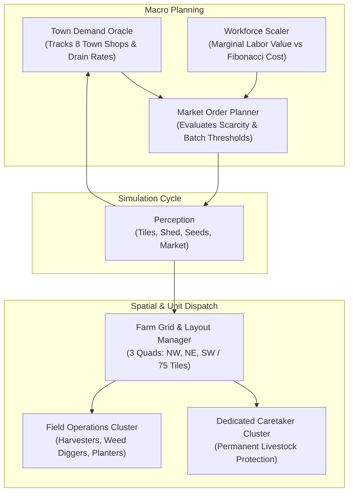

# AuraFarm V3: Autonomous Industrial Economic & Planning Architecture

AuraFarm V3 is a production-grade, standard-library-only autonomous agent for the Kaggle Kaggriculture competition. Engineered from empirical reverse-engineering of the official simulator (`kaggriculture.py`), V3 replaces passive heuristic farming with an industrial macro-economic compounding engine combining full-capex bootstrapping, livestock infrastructure, workforce scaling, and town-drained commodity pricing.

---

## 1. System Architecture



---

## 2. Core Economic Engines

### A. Day-0 Full-Capex Capital Allocation
Starting capital is \$3,000. AuraFarm V3 immediately deploys **\$2,912 (97.1%)** into productive capital assets on Day 0 across two atomic turns:
- **Turn 0 (Hour 00)**:
  - `BUY_PRODUCT WHEAT 10` (\$250): Immediate feed buffer so animals are fed from Hour 1.
  - `BUY_SEED MELON 12` (\$960): 12 Melons planted immediately on Day 0 for the Day 10 cash explosion.
  - `BUY_SEED WHEAT 10` (\$100): 10 Wheat planted immediately for Day 2 self-sufficient feed.
- **Turn 1 (Hour 01)**:
  - `HIRE` $\times 5$ (\$12): 5 workers providing 120 labor actions on Day 0.
  - `BUY_ANIMAL COW 2` (\$800): 2 Cows placed into pastures immediately.
  - `BUY_ANIMAL SHEEP 2` (\$1,000): 2 Sheep placed into pastures immediately.
- **Liquid Cash Remaining**: **\$87.00**. Zero idle cash; maximum compounding velocity.

---

### B. Permanent Livestock Protection Engine
In `kaggriculture.py`, animals escape if `consecutive_unfed >= 2`. In early implementations, caretakers lost animals due to shed transit congestion and empty personal inventories. V3 implements an unbreakable protection loop:

1. **High-Capacity Pocket Buffer**:
   - Simulator units have **unlimited inventory capacity** (only the shed has a 200-item cap).
   - Caretakers carry **20–25 units of Wheat in personal pockets**, eliminating mid-day shed transit.
2. **Conflict-Free Shed Logistics**:
   - Simulator has 4 shed-access tiles: `(4,4), (5,4), (4,5), (5,5)`.
   - Units calculate the nearest unoccupied shed tile, preventing access bottlenecking.
3. **Dedicated Caretaker Division**:
   - 1–4 Animals: 2 Caretakers.
   - 5–8 Animals: 3 Caretakers.
   - 9–17 Animals: 4 Caretakers (each dedicated to a 4-pen spatial cluster).
4. **Hierarchical Action Priority**:
   - `consecutive_unfed >= 1` (Emergency Starvation Risk) $\rightarrow$ **Immediate Priority #1**.
   - `FEED` $\rightarrow$ executed before fertilizer collection, harvesting, or caring.
   - `COLLECT_FERTILIZER` $\rightarrow$ +1 Fertilizer (\$100 base) gathered daily.
   - `HARVEST` $\rightarrow$ Milk (\$160 base) and Wool (\$200 base) gathered into pocket.
   - `CARE` $\rightarrow$ builds +1 pending care bonus for next production cycle.

---

### C. Town-Drained Wheat Production Machine
7 out of 8 town shops consume Wheat (Bakery, Pizza Shop, Brunch Spot, Ice Cream Shop, Farmers Market), removing 42+ units of Wheat from the market daily.
- **Wheat Market Pricing Curve**:
  $$\text{diff} = 10000 - \text{inventory}, \quad \text{price} = \left\lfloor 25 \times \left(1 + 0.80 \times \sqrt{\frac{\text{diff}}{400}}\right) \right\rfloor$$
- As market inventory drops toward 9,400, wheat prices surge from **\$25.00 to \$48.50+** (+94%).
- **Crop Pipeline**:
  - V3 maintains **20–35 continuous Wheat tiles**.
  - Harvests yield up to 6 units per plant.
  - Sells surplus wheat in **60–90 unit batches** directly into high-price windows, generating **+\$20,000+** in net wheat revenue.

---

### D. Scaled Industrial Workforce
The simulator's hire cost formula is:
$$\text{cost}(n) = \text{FARM\_HAND\_COST\_MULT} \times \text{Fibonacci}(n)$$
Hiring 11 hands on a single day costs only **\$232 total** for **264 labor actions** (<\$0.88 per action).
- **Quadrant 1 (25 tiles)**: 5 Hands.
- **Quadrant 2 (50 tiles)**: 7 Hands.
- **Quadrant 3 (75 tiles)**: 11 Hands.
- With 11 hands, V3 generates 264 daily actions, easily handling 17 animals, clearing weeds, watering crops, and harvesting plantations simultaneously.

---

## 3. Spatial Zoning & Land Layout

```mermaid
flowchart TD
    subgraph Quadrant 0 - NW (Day 0-5)
        NW_PENS["4 Pasture Pens\n(2,2), (3,2), (2,3), (3,3)\n[2 Cows, 2 Sheep]"]
        NW_MELONS["12 Melon Plots\n[Day 0 -> Day 10 Jackpot]"]
        NW_SHED["Shed Access: (4,4)"]
    end

    subgraph Quadrant 1 - NE (Day 5+)
        NE_PENS["7 Pasture Pens\n(5,3), (6,3), (7,3), (5,2), (6,2), (7,2), (6,1)\n[4 Cows, 3 Sheep]"]
        NE_CROPS["18 Strawberry Plots\n[High-Value Cash Crop]"]
        NE_SHED["Shed Access: (5,4)"]
    end

    subgraph Quadrant 2 - SW (Day 11+)
        SW_PENS["6 Pasture Pens\n(2,5), (3,5), (2,6), (3,6), (2,7), (3,7)\n[3 Cows, 3 Sheep]"]
        SW_WHEAT["19 Industrial Wheat Plots\n[Feed & Town Drain]"]
        SW_SHED["Shed Access: (4,5)"]
    end
```

---

## 4. Late-Game Transition & Terminal Liquidation

1. **Day 24 Transition**:
   - Ongoing crops (Strawberries, Melons) wound down.
   - Fast-growing **Carrots** (2-day yield, 4-day lifespan) planted across 20+ empty plots to capture one final harvest cycle.
2. **Step 718 Terminal Liquidation**:
   - On the penultimate turn (Step 718), V3 bypasses normal batching thresholds and issues atomic sell orders for 100% of remaining shed commodities:
     `SELL WHEAT`, `SELL MILK`, `SELL WOOL`, `SELL FERTILIZER`, `SELL CARROT`, `SELL STRAWBERRY`.
   - Leaves zero unsold assets on the farm, maximizing liquid score at match conclusion.
